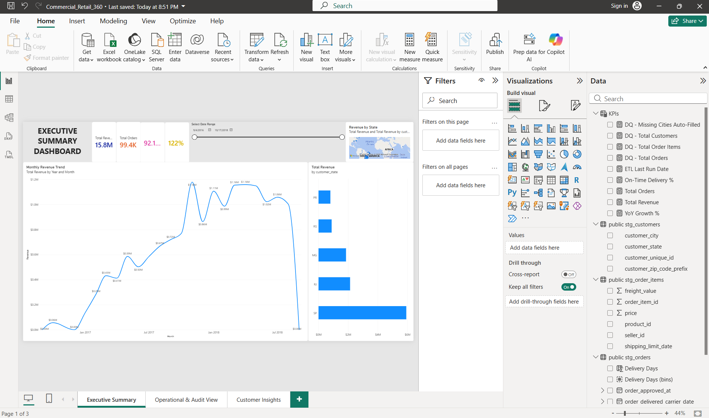
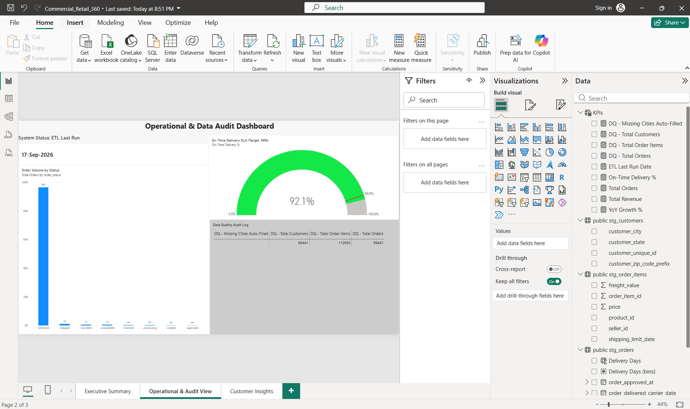
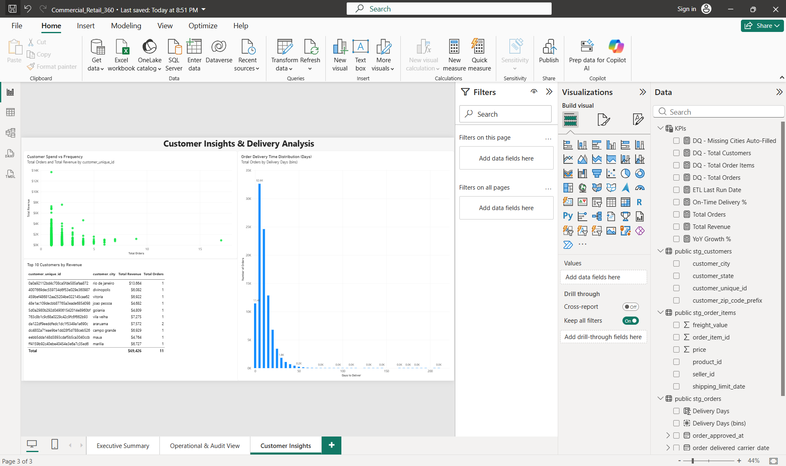
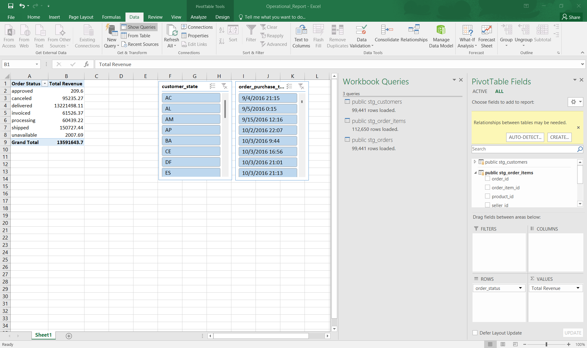

# Commercial Retail 360: Data Governance, Automation, and Strategic Analytics Suite

## 📌 Business Context
Management identified that recent strategic decisions were compromised by flawed data (duplicates, missing fields) and slow, manual reporting. This project serves as an end-to-end analytics solution to audit raw data, automate the ETL pipeline, ensure statutory compliance, and deliver a strategic Power BI suite to the executive team.

## 🛠️ Tech Stack
* **Database:** PostgreSQL (Enterprise Relational DB)
* **Data Quality & ETL:** Python (Pandas, SQLAlchemy), SQL
* **Analytics & BI:** Power BI (Star Schema, DAX), Excel (Power Pivot)
* **Framework:** ITIL Service Management (Incident & Change Management)

## 📂 Repository Structure
* **`/docs`**: Project scoping, stakeholder matrices, data audit logs, and ITIL frameworks.
* **`/sql`**: Enterprise-grade SQL scripts for schema creation, data deduplication, PII masking, and complex analytics (CTEs, Window Functions).
* **`/python`**: Automated ETL pipeline and statistical analysis scripts.
* **`/powerbi`**: DAX measures and data modeling guide for the semantic layer.
* **`/presentation`**: Executive stakeholder pitch script.

## 📊 Dashboard Screenshots

### Executive Summary Dashboard

### Operational & Audit View

### Customer Insights

### Excel Mid-Management Operational Report

##  Video Presentation
[Watch the 5-minute stakeholder pitch](YOUR_LOOM_YOUTUBE_LINK_HERE)

## 🚀 How to Run
1. Clone the repo.
2. Install Python dependencies: `pip install -r python/requirements.txt`
3. Set up PostgreSQL and run the scripts in the `/sql` folder in numerical order.
4. Run the ETL pipeline: `python python/etl_pipeline.py`

